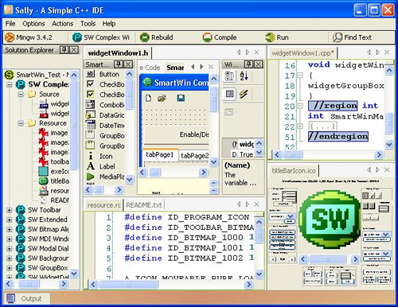
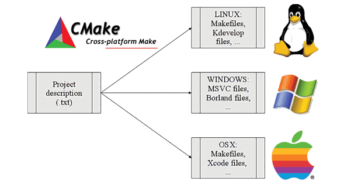
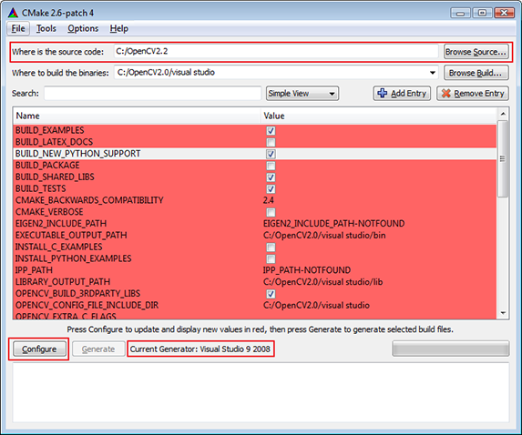
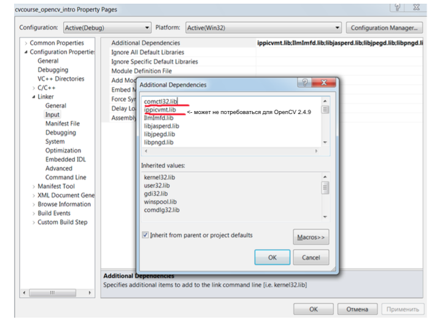

# Создание проектов



Александр Шишков (Itseez, ННГУ)\
Март 2016

<!-- TODO
  - Заменить старые CMake слайды новыми (в самом конце)
  - Убрать отсюда метапрограммирование
    - Подумать не стоит ли и IDE в отдельную лекцию (собственно разработка)
  - Вставить слайд с системами сборки для разных языков
  - Показать простой проект MSVS (аналогичный CMake)
  - Вставить ответы на задаваемые контрольные вопросы
-->

# Содержание

  1. IDE
  1. Билд-системы
  1. CMake

# IDE

> __Интегрированная среда разработки, ИСР__ (англ. __IDE, Integrated development
> environment__ или __integrated debugging environment__) — система программных
> средств, используемая программистами для разработки программного обеспечения.

В чем отличие IDE от редакторов исходного кода?

# Основные модули IDE

IDE - это не только ценный мех:

  - Текстовый редактор
  - Компилятор и/или интерпретатор
  - Средства автоматизации сборки
  - Отладчик

# Функции современных IDE

  - Автодополнение кода
  - Поддержка шаблонов проектов
  - Сниппеты
  - Поддержка систем контроля версий
  - Интеграция задач (`//TODO: ...`)
  - Браузер классов
  - Визульное редактирование классов
  - Инструменты рефакторинга
  - Профилировщик
  - Работа с СУБД, веб-сервисами
  - и т.д.

# Плагины для IDE

JetBrains [Resharper](http://www.jetbrains.com/resharper/features/index.html)

  - Статический анализ кода
  - Сниппеты
  - Инструменты рефакторинга
  - Поддержка unit-тестов
  - Инструменты автогенерации кода
  - ...

# Классификация IDE

 1. По количеству поддерживаемых языков
    - NetBeans, Xcode, Microsoft Visual Studio
    - Visual Basic, Delphi, Dev-C++

 1. Online/offline
    - NetBeans, Xcode, Microsoft Visual Studio
    - Eclipse Орион, Cloud 9 IDE, eXo Cloud IDE, ideone

# Сравнение С++ IDE

<center></center>

# Содержание

  1. IDE
  1. <font color=red>Билд-системы</font>
  1. CMake

# Цель

После написания кода приложения необходимо уметь:

  - компилировать файлы с исходным кодом
  - линковать их с библиотеками
  - распространять их как (source/binary)
  - запускать тесты

# Компиляция

Как компилировать?

 - gcc ­c a.out main.cpp

# Компиляция

А теперь представим:

 - проект содержит несколько тысяч файлов
 - некоторые файлы должны компилироваться только на некоторых ОС
 - для разных заказчиков вы должны собирать проект:
     - с разными define (DEBUG/RELEASE, LOG)
     - для разных ОС
     - для разных компиляторов
     - ...

# Линковка и другие аспекты

 - Линковка
 - Распространение приложений
     - .rpm, .msi, .dmg, .exe, InstallShield, .tar.gz, .zip, .7z, ...
 - Тестирование

# История

 - shell скрипты

compile.sh:

```tbd
#!/bin/sh
cc -c main.c
cc -c lib.c
cc -o program main.o lib.o
```

 - make, 1977 год

Makefile:

```tbd
OBJ = main.o lib.o
program: $(OBJ)
        cc -o program $(OBJ)
$(OBJ): defines.h
```

# Autotools

Makefile.am:

```tbd
bin_PROGRAMS = hello
hello_SOURCES = main.c lib.c
```

configure.ac:

```tbd
AC_INIT([program], [1.0], [sample@mail.org])
AM_INIT_AUTOMAKE([-Wall -Werror foreign])
AC_PROG_CC
AC_CONFIG_HEADERS([config.h])
AC_CONFIG_FILES([
 Makefile
])
AC_OUTPUT
```

Для запуска:

```tbd
autoreconf --install
./configure
make
```

# Autotools

Было де-факто стандартом и до сих пор используется, но:

 - слишком сложно
 - только Unix
 - sh, m4
 - зависимости

# Содержание

  1. IDE
  1. Билд-системы
  1. <font color=red>CMake</font>


# CMake

<center></center>

  - Широкая поддержка разнообразных целевых платформ и IDE
  - Максимальная свобода в выборе окружения разработки (в рамках одной команды!)
  - В настоящий момент является стандартом де-факто для С++ проектов

# CMake Workflow

`CMakeLists.txt` — файл, описывающий порядок сборки приложения

+-----------------------------------------------------------------------------------+-----------------------------+
| - __Шаг 0__. Генерация _проектных файлов_ при помощи `cmake` или `CMakeGui`       ||
|     - `.vcproj, Makefile, etc`                                                    |                             |
| - __Шаг 1__. Компиляция исходников при помощи компиляторов из Visual Studio,      |                             |
|          Qt Creator, Eclipse, XCode...                                            |                             |
|     - `.obj, .o`                                                                  |                             |
| - __Шаг 2__. Линковка финальных бинарных файлов компоновщиком (link.exe, ld, ...) |                             |
|     - `.exe, .dll, .lib, .a, .so, .dylib`                                         |                             |
+-----------------------------------------------------------------------------------+-----------------------------+

# CMake GUI



# Out of source build

__Плохо__: в директории с исходным кодом

```txt
code
├── hello.cpp
└── hello.exe # Этот файл может случайно попасть в историю Git
```

__Хорошо__: вне директории (чистый репозиторий, несколько build-директорий)

```txt
code
└── hello.cpp
build
└── hello.exe
```

Соответствующие команды:
```bash
$ cd <code>
$ mkdir ../build && cd ../build
$ cmake ../<code>
```

# Пример сборки приложения (`add_executable`)

Содержимое каталога:

```txt
code
├── CMakeLists.txt
├── lib.h
├── lib.c
└── main.c
```

`CMakeLists.txt`

```cmake
cmake_minimum_required(VERSION 2.8)
project(first_sample)

set(SOURCES main.c lib.c)
add_executable(sample_app ${SOURCES}) # Объявляет исполняемый модуль с именем sample_app
```

# Пример сборки библиотеки (`add_library`)

Содержимое каталога:

```txt
code
├── CMakeLists.txt
├── lib.h
├── lib.c
└── main.c
```

`CMakeLists.txt`

```cmake
cmake_minimum_required(VERSION 2.8)
project(second_sample)

set(SOURCE_LIB lib.c)
add_library(library STATIC ${SOURCE_LIB}) # Объявляет библиотеку с именем library

set(SOURCES main.c)
add_executable(main ${SOURCES}) # Объявляет исполняемый модуль с именем sample_app
target_link_libraries(sample_app library) # Указывает зависимость от библиотеки
```

# Debug / Release

В `CMakeLists.txt`:

```cmake
SET(CMAKE_BUILD_TYPE Debug)
```

В командной строке:

```bash
$ cmake -­DCMAKE_BUILD_TYPE=Debug ../code # Запомните эту команду!
```

Для библиотек:

```cmake
TARGET_LINK_LIBRARIES(lib RELEASE ${lib_SRCS})
TARGET_LINK_LIBRARIES(libd DEBUG ${lib_SRCS})
```

# Добавление подпроекта

Содержимое каталога:

```txt
code
├── CMakeLists.txt
├── library
│   ├── CMakeLists.txt
│   ├── lib.c
│   └── lib.h
└── main.c
```

Корневой `CMakeLists.txt`:

```cmake
cmake_minimum_required(VERSION 2.8)
project(third_sample)

add_subdirectory(library) # Указывает, что в директории library есть свой CMakeLists.txt

include_directories(library)
set(SOURCES main.c)
add_executable(sample_app ${SOURCES})

target_link_libraries(sample_app library)
```

# Добавление подпроекта (#2)

`library/CMakeLists.txt`

```cmake
cmake_minimum_required(VERSION 2.8)
project(library)

set(SOURCE_LIB lib.c)
add_library(library STATIC ${SOURCE_LIB})
```

# Поиск библиотек



# Поиск зависимостей

`CMakeLists.txt`

```cmake
cmake_minimum_required(VERSION 2.8)
project(sample)

# Поиск OpenCV
find_package(OPENCV REQUIRED)
if(NOT OPENCV_FOUND)
    message(SEND_ERROR "Failed to find OpenCV")
    return()
else()
    include_directories(${OPENCV_INCLUDE_DIR})
endif()

add_executable(sample_app main.c)
target_link_libraries(sample_app ${OPENCV_LIBRARIES})
```

# CMake: Резюме

  - Основной "недостаток" — собственный язык
  - Поначалу инструмент кажется нетривиальным, но очень удобен впоследствии
  - Дает членам команды максимальную свободу в выборе инструментов\
    (OC, IDE или простой текстовый редактор)
  - Обеспечивает переносимость и является стандартом де-факто\
    для кросс-платформенных С++ проектов

# Билд-системы

Популярные билд-системы:

   - [SCons](http://www.scons.org)
      - [Waf](https://code.google.com/p/waf/)
   - [Rake](https://github.com/ruby/rake)
   - [Makeit](https://bitbucket.org/grahamdumpleton/makeit)
   - [Jam](http://www.perforce.com/resources/documentation/jam)
   - [qmake](http://en.wikipedia.org/wiki/Qmake)
   - [Maven](http://maven.apache.org/)

# Резюме

  1. Использование современных IDE может существенно облегчить процесс
     разработки.
  1. Метапрограммирование позволяет динамически создавать однотипный код.
  1. Билд-системы - незаменимый инструмент при разработке кроссплатформенных
     приложений.

# Контрольные вопросы

  1. Определение ИСР
  1. Отличия ИСР от редакторов исходного кода
  1. Основные функции/возможности современных ИСР
  1. Иcтория развития билд-систем
  1. Плюсы и минусы Makefile
  1. Плюсы и минусы CMake

# Ссылки

  1. <http://ru.wikipedia.org/wiki/Сравнение_IDE>
  1. <http://rus-linux.net/lib.php?name=/MyLDP/algol/lex-yacc-howto.html>
  1. <http://www.scons.org/wiki/SconsVsOtherBuildTools>

# Спасибо!

Вопросы?

<!-- LINKS -->
